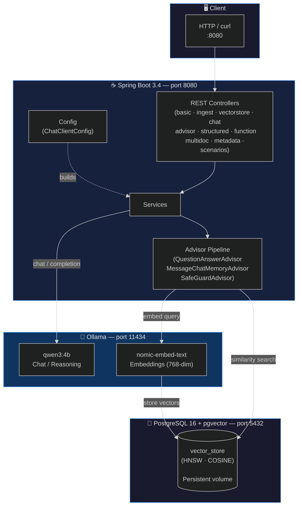
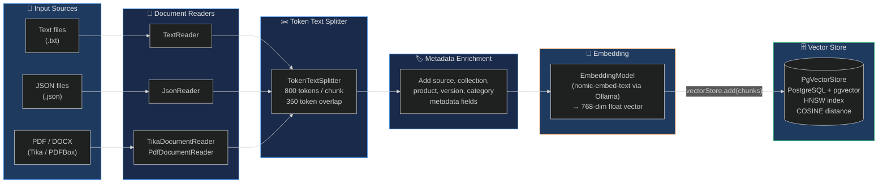
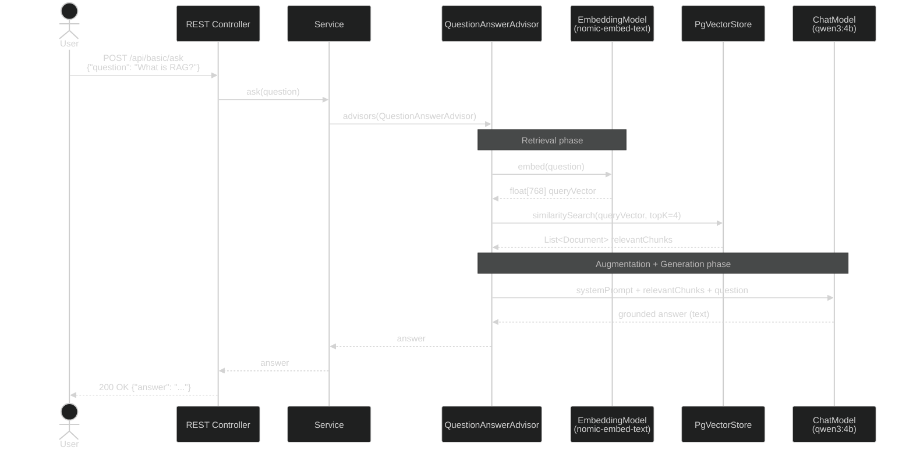
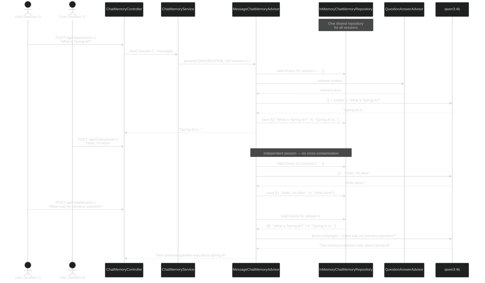
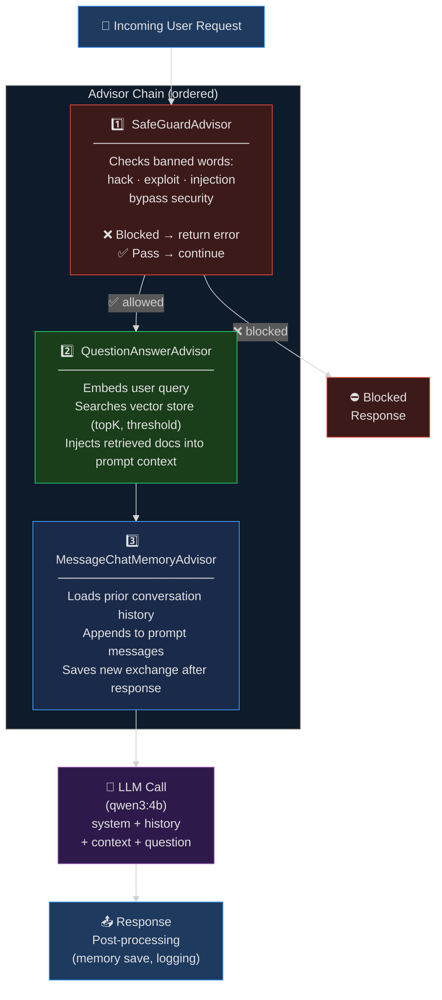
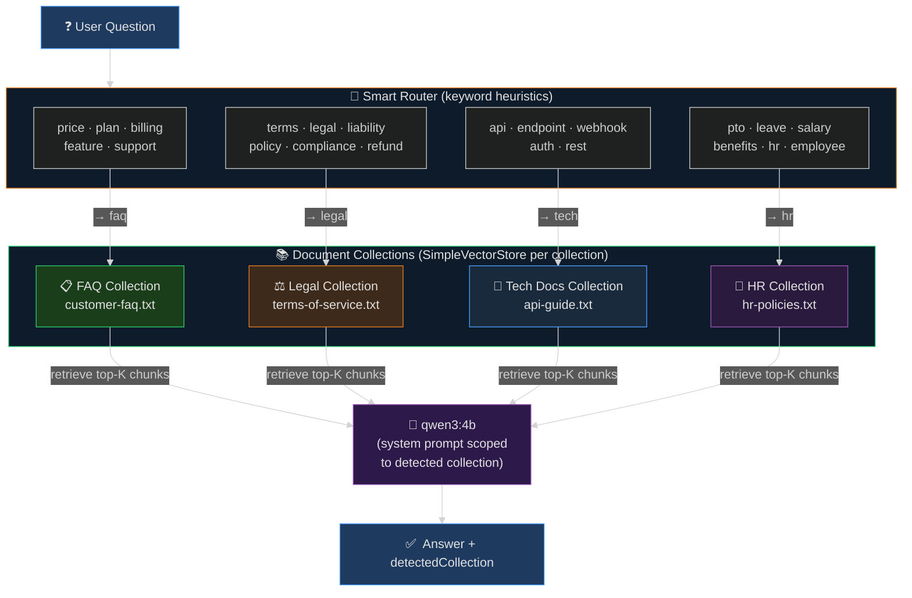
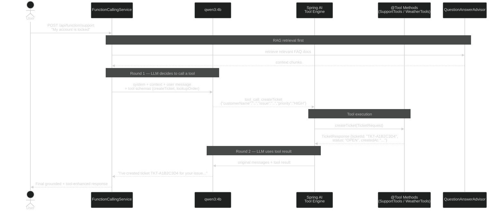
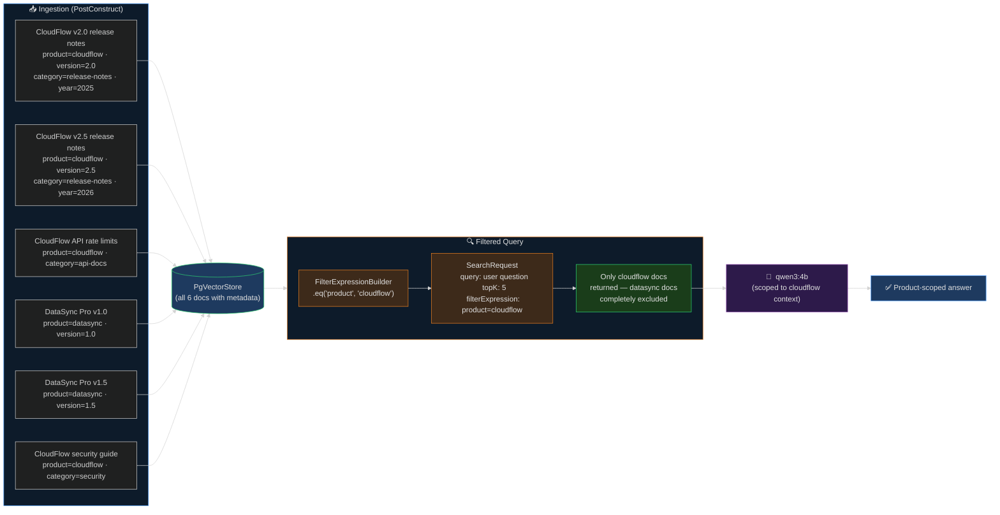
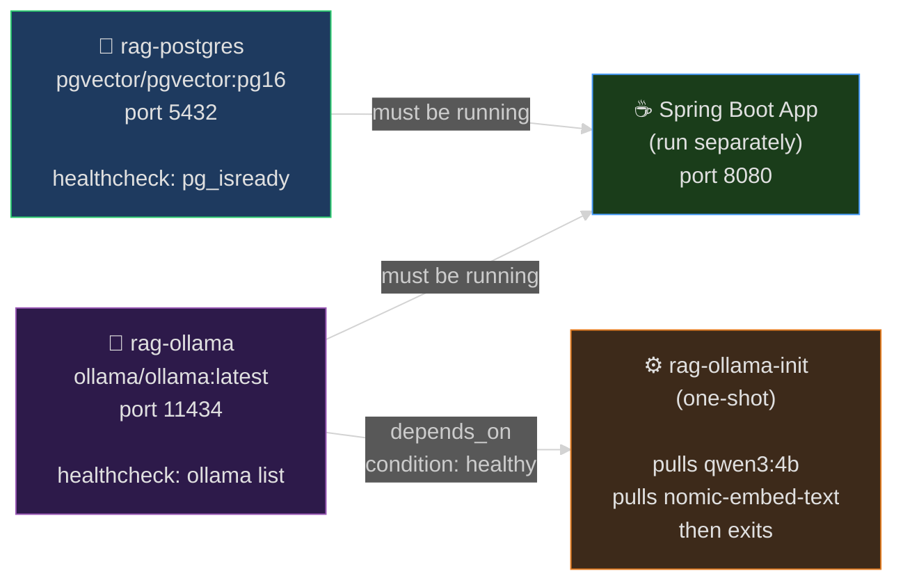

# Architecture Diagrams — RAG with Spring AI

> All diagrams use the **dark theme** for correct rendering on dark editor/viewer backgrounds (GitHub dark mode, IntelliJ, VS Code, Obsidian, etc.).

---

## Table of Contents

1. [System Architecture](#1-system-architecture)
2. [RAG Ingestion Pipeline](#2-rag-ingestion-pipeline)
3. [RAG Query Pipeline](#3-rag-query-pipeline)
4. [Chat Memory & Session Management](#4-chat-memory--session-management)
5. [Advisor Execution Chain](#5-advisor-execution-chain)
6. [Multi-Document RAG & Smart Routing](#6-multi-document-rag--smart-routing)
7. [Function / Tool Calling Flow](#7-function--tool-calling-flow)
8. [Metadata Filtering Flow](#8-metadata-filtering-flow)
9. [Structured Output Pipeline](#9-structured-output-pipeline)
10. [Module & Package Overview](#10-module--package-overview)

---

## 1. System Architecture

High-level view of the three-tier stack and how each component communicates.



---

## 2. RAG Ingestion Pipeline

How raw documents are loaded, split, embedded, and stored in the vector database.



---

## 3. RAG Query Pipeline

Sequence of operations from a user's question to a grounded answer.



---

## 4. Chat Memory & Session Management

How `MessageChatMemoryAdvisor` maintains per-session conversation history with an in-memory repository.



---

## 5. Advisor Execution Chain

Advisors implement a chain-of-responsibility pattern, executing in declaration order before and after the LLM call.



---

## 6. Multi-Document RAG & Smart Routing

Four isolated in-memory `SimpleVectorStore` collections with keyword-based automatic routing.



---

## 7. Function / Tool Calling Flow

Spring AI inspects `@Tool`-annotated methods, generates a JSON schema, and manages multi-round LLM ↔ tool interactions automatically.



---

## 8. Metadata Filtering Flow

Documents are tagged with structured metadata at ingestion time; `FilterExpressionBuilder` restricts vector search to matching documents only.



---

## 9. Structured Output Pipeline

`ChatClient.call().entity(Type.class)` uses `BeanOutputConverter` to inject format instructions into the prompt and parse the JSON response into a typed Java record.

```mermaid
%%{init: {'theme': 'dark'}}%%
flowchart LR
    Q["❓  User Query\ne.g. 'data privacy terms'"]

    subgraph SPRING["Spring AI  BeanOutputConverter"]
        direction TB
        FI["1. Generate format instructions\nfrom target Java type schema\n(JSON Schema → prompt suffix)"]
        PROMPT["2. Build prompt\nsystem + context + query\n+ format instructions"]
    end

    QAAdv["QuestionAnswerAdvisor\n(retrieves relevant docs)"]
    LLM["🤖  qwen3:4b\nResponds with\nstructured JSON"]

    subgraph PARSE["Deserialization"]
        direction TB
        J["JSON response\n{\"section\":\"§7\",\"title\":\"Privacy\"\n\"summary\":\"...\",\"relevance\":\"HIGH\"}"]
        REC["Java Record\nLegalClause(\n  section, title,\n  summary, relevance\n)"]
        J --> REC
    end

    ANS["✅  List&lt;LegalClause&gt;\nor FaqEntry\nor List&lt;ApiEndpoint&gt;"]

    Q --> QAAdv --> SPRING
    FI --> PROMPT
    PROMPT --> LLM
    LLM --> PARSE
    REC --> ANS

    style Q fill:#1e3a5f,stroke:#4a9eff,color:#e0e0e0
    style SPRING fill:#0d1b2a,stroke:#e67e22,color:#e0e0e0
    style QAAdv fill:#1a3d1a,stroke:#2ecc71,color:#e0e0e0
    style LLM fill:#2d1a4a,stroke:#9b59b6,color:#e0e0e0
    style PARSE fill:#1a2a3d,stroke:#4a9eff,color:#e0e0e0
    style ANS fill:#1e3a5f,stroke:#4a9eff,color:#e0e0e0
```

---

## 10. Module & Package Overview

Full package map showing each module's controller/service pair and the shared infrastructure they depend on.

```mermaid
%%{init: {'theme': 'dark'}}%%
graph TB
    subgraph CORE["⚙️  Core Infrastructure"]
        direction LR
        CC["ChatClientConfig\n(default ChatClient bean)"]
        PGV["PgVectorStore\n(auto-configured\nby Spring AI starter)"]
        EM["EmbeddingModel\n(nomic-embed-text)"]
        CM["ChatModel\n(qwen3:4b)"]
        CC --> CM
        PGV --> EM
    end

    subgraph MODELS["📐  Shared Model Records"]
        direction LR
        RR["RagResponse"]
        FE["FaqEntry"]
        LC["LegalClause"]
        AE["ApiEndpoint"]
        PI["PolicyInfo"]
        MR["MessageRequest\nQuestionRequest\nQueryRequest"]
    end

    subgraph DEMOS["🧪  Capability Demos"]
        direction TB
        D1["basic\nBasicRagController\nBasicRagService"]
        D2["ingestion\nIngestionController\nIngestionService"]
        D3["vectorstore\nVectorStoreController\nVectorStoreService"]
        D4["memory\nChatMemoryController\nChatMemoryService"]
        D5["advisor\nAdvisorController\nAdvisorService"]
        D6["structured\nStructuredOutputController\nStructuredOutputService"]
        D7["function\nFunctionCallingController\nFunctionCallingService\nFunctionConfig"]
        D8["multidoc\nMultiDocController\nMultiDocService"]
        D9["metadata\nMetadataFilterController\nMetadataFilterService"]
    end

    subgraph SCENARIOS["🌍  Real-World Scenarios"]
        direction TB
        S1["scenarios/support\nSupportController\nSupportService"]
        S2["scenarios/legal\nLegalSearchController\nLegalSearchService"]
        S3["scenarios/techdocs\nTechDocsController\nTechDocsService"]
        S4["scenarios/hr\nHrPolicyController\nHrPolicyService"]
    end

    CORE --> DEMOS
    CORE --> SCENARIOS
    MODELS --> D6 & D7 & S2 & S3 & S4

    style CORE fill:#1a2a4a,stroke:#4a9eff,color:#e0e0e0
    style MODELS fill:#1a2a3d,stroke:#9b59b6,color:#e0e0e0
    style DEMOS fill:#0d1b2a,stroke:#2ecc71,color:#e0e0e0
    style SCENARIOS fill:#1a2a1a,stroke:#e67e22,color:#e0e0e0
    style D1 fill:#163216,stroke:#2ecc71,color:#e0e0e0
    style D2 fill:#163216,stroke:#2ecc71,color:#e0e0e0
    style D3 fill:#163216,stroke:#2ecc71,color:#e0e0e0
    style D4 fill:#163216,stroke:#2ecc71,color:#e0e0e0
    style D5 fill:#163216,stroke:#2ecc71,color:#e0e0e0
    style D6 fill:#163216,stroke:#2ecc71,color:#e0e0e0
    style D7 fill:#163216,stroke:#2ecc71,color:#e0e0e0
    style D8 fill:#163216,stroke:#2ecc71,color:#e0e0e0
    style D9 fill:#163216,stroke:#2ecc71,color:#e0e0e0
    style S1 fill:#2a1a16,stroke:#e67e22,color:#e0e0e0
    style S2 fill:#2a1a16,stroke:#e67e22,color:#e0e0e0
    style S3 fill:#2a1a16,stroke:#e67e22,color:#e0e0e0
    style S4 fill:#2a1a16,stroke:#e67e22,color:#e0e0e0
```



---

## Docker Compose Service Dependencies

Startup order and health-check dependencies between Docker services.



