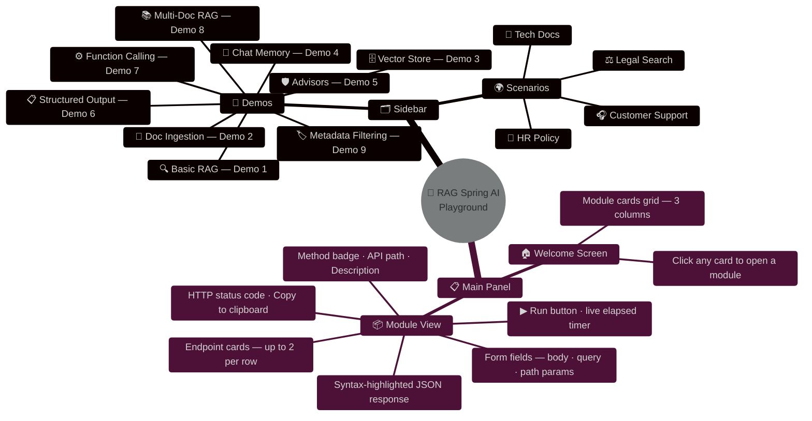
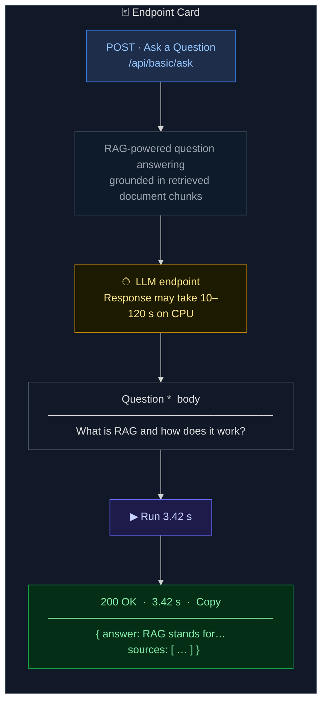
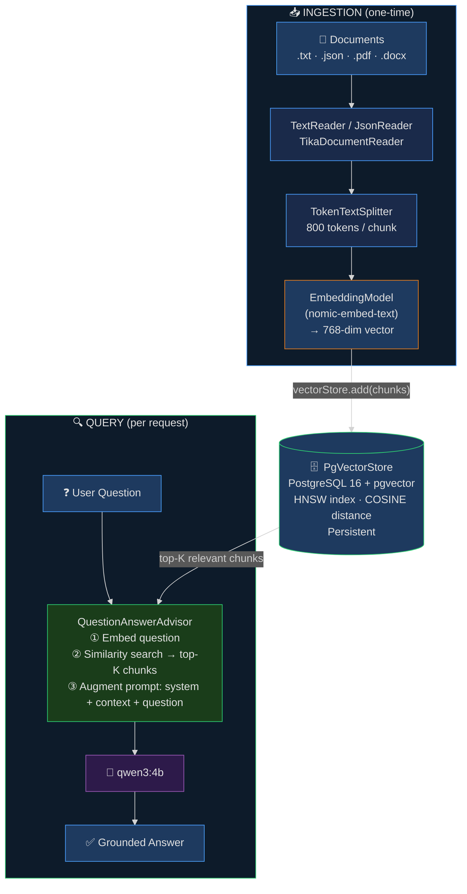

# RAG with Spring AI & Ollama — Comprehensive Demo Project

<p align="center">
  
  
  
  
  
  
  
</p>

> A complete, hands-on guide to building **Retrieval-Augmented Generation** applications with **Spring AI** and **Ollama** (Qwen 3), covering 9 capability demos and 4 real-world scenarios — all running locally with zero cloud dependencies.

---

## 📋 Table of Contents

- [Overview](#-overview)
- [Technology Stack](#-technology-stack)
- [Prerequisites](#-prerequisites)
- [Quick Start](#-quick-start)
- [Running Locally — Step by Step](#running-locally--step-by-step)
- [Project Architecture](#️-project-architecture)
- [Web Playground (Frontend)](#-web-playground-frontend)
- [API Reference](#-api-reference)
- [Swagger / OpenAPI Specification](#-swagger--openapi-specification)
- [Configuration](#️-configuration)
- [Makefile Reference](#️-makefile-reference)
- [Testing](#-testing)
- [How RAG Works](#-how-rag-works)
- [Key Spring AI Concepts](#-key-spring-ai-concepts)

---

## 🗺 Overview

| # | Demo | Description | Base Path |
|---|------|-------------|-----------|
| 1 | [Basic RAG](docs/01-basic-rag.md) | Simple question answering over documents | `/api/basic/*` |
| 2 | [Document Ingestion](docs/02-document-ingestion.md) | Loading text, JSON, and PDF documents | `POST /api/ingest/*` |
| 3 | [Vector Store Operations](docs/03-vector-store.md) | Similarity search, embeddings, thresholds | `/api/vectorstore/*` |
| 4 | [Chat with Memory](docs/04-chat-memory.md) | Conversational RAG with session history | `/api/chat/*` |
| 5 | [Advisors](docs/05-advisors.md) | QuestionAnswerAdvisor, SafeGuard, composition | `POST /api/advisor/*` |
| 6 | [Structured Output](docs/06-structured-output.md) | Typed Java records from LLM responses | `POST /api/structured/*` |
| 7 | [Function Calling](docs/07-function-calling.md) | LLM-invoked tools with RAG context | `POST /api/function/*` |
| 8 | [Multi-Document RAG](docs/08-multi-document-rag.md) | Multiple collections with smart routing | `/api/multidoc/*` |
| 9 | [Metadata Filtering](docs/09-metadata-filtering.md) | Filter vector search by metadata | `/api/metadata/*` |

### 🌍 Real-World Scenarios

| Scenario | Description | Base Path | Doc |
|----------|-------------|-----------|-----|
| Customer Support Bot | FAQ-powered chatbot with session memory | `/api/scenarios/support/*` | [docs](docs/10-scenario-customer-support.md) |
| Legal Document Search | Clause search & compliance checks | `/api/scenarios/legal/*` | [docs](docs/11-scenario-legal-search.md) |
| Tech Docs Assistant | API documentation Q&A with curl generation | `/api/scenarios/techdocs/*` | [docs](docs/12-scenario-tech-docs.md) |
| HR Policy Q&A | Employee handbook assistant | `/api/scenarios/hr/*` | [docs](docs/13-scenario-hr-policy.md) |

---

## 🛠 Technology Stack

| Layer | Technology | Version | Role |
|-------|-----------|---------|------|
| Language | Java | 25 (LTS) | Application runtime |
| Framework | Spring Boot | 3.5.13 | Web + DI + auto-configuration |
| AI Framework | Spring AI | 1.1.4 | LLM abstraction, RAG, advisors, tools |
| LLM / Embeddings | Ollama | latest | Local model server |
| Chat model | Qwen 3 4B | `qwen3:4b` | Instruction-following, tool calling |
| Embedding model | Nomic Embed Text | `nomic-embed-text` | 768-dim text embeddings |
| Vector store | PostgreSQL + pgvector | 16 + HNSW | Persistent similarity search |
| Containerization | Docker Compose | 24+ | Orchestrates Postgres + Ollama |
| Build tool | Maven | 3.9 (wrapper) | Dependency management + packaging |
| Testing | JUnit 5 + Mockito + H2 | — | Unit & slice tests with in-memory DB |

> **No cloud account needed.** Everything — models, vector store, and the Spring Boot app — runs fully offline on your machine.

---

## ✅ Prerequisites

| Tool | Version | Purpose |
|------|---------|---------|
| **Java** | 25+ | Runtime (project targets Java 25) |
| **Docker & Docker Compose** | 24+ | Runs PostgreSQL + pgvector + Ollama |
| **Git** | any | Clone the repo |
| **make** *(optional)* | any | Convenience wrapper around Maven & Docker |

> **No local Ollama install needed.** Ollama runs inside Docker via `docker-compose.yml`.  
> If you prefer a native Ollama install, see [Option B: Native Ollama](#option-b-native-ollama) below.

### Check your Java version

```bash
java -version
# Should print: openjdk version "25.x.x" or higher
```

If you need Java 25, install it via [SDKMAN](https://sdkman.io/) (recommended) or [Adoptium](https://adoptium.net/):

```bash
# SDKMAN — check available Java 25 builds with: sdk list java
sdk install java 25.0.2-tem
sdk use java 25.0.2-tem
```

---

## 🚀 Quick Start

> **TL;DR** — three commands and the full stack is running.

```bash
# 1. Start infrastructure (Postgres + Ollama) and pull AI models (~5 min on first run)
make setup

# 2. Start the Spring Boot application
make run

# 3. Open the interactive playground in your browser
open http://localhost:8080

# Or use curl directly:
curl -s -X POST http://localhost:8080/api/basic/ingest | jq
curl -s -X POST http://localhost:8080/api/basic/ask \
  -H "Content-Type: application/json" \
  -d '{"question": "What is RAG and how does it work?"}' | jq
```

---

## Running Locally — Step by Step

### Option A: Docker (Recommended)

Everything — PostgreSQL with the pgvector extension and Ollama — runs in Docker.

#### Step 1 — Start infrastructure

```bash
docker compose up -d --remove-orphans
```

This starts three services:

| Container | Role | Port |
|-----------|------|------|
| `rag-postgres` | PostgreSQL 16 + pgvector extension | 5432 |
| `rag-ollama` | Ollama LLM server | 11434 |
| `rag-ollama-init` | One-shot model downloader (exits when done) | — |

#### Step 2 — Wait for models to download

The first run downloads ~3 GB of model weights. Monitor progress:

```bash
docker compose logs -f ollama-init
# Wait until you see: "All models ready!"
```

Verify models are available:

```bash
docker exec rag-ollama ollama list
# NAME                     SIZE
# nomic-embed-text:latest  274 MB
# qwen3:4b                 2.6 GB
```

> If `ollama-init` failed or exited early, re-pull manually: `make pull-models`

#### Step 3 — Run the Spring Boot application

```bash
./mvnw spring-boot:run
```

Or with Make:

```bash
make run
```

The server starts at **http://localhost:8080**. Spring AI will automatically create the `vector_store` table in PostgreSQL on the first request (controlled by `initialize-schema: true` in `application.yaml`).

#### Step 4 — Ingest sample documents

The vector store is empty on a fresh start. Load documents before querying:

```bash
# Ingest the Spring AI overview (plain text)
curl -s -X POST http://localhost:8080/api/ingest/text | jq

# Ingest the AI concepts document (JSON)
curl -s -X POST http://localhost:8080/api/ingest/json | jq

# Ingest documents used by the Basic RAG demo
curl -s -X POST http://localhost:8080/api/basic/ingest | jq
```

The vector store is **persistent** — ingested documents survive application restarts.

#### Step 5 — Try a query

```bash
curl -s -X POST http://localhost:8080/api/basic/ask \
  -H "Content-Type: application/json" \
  -d '{"question": "What is RAG and how does it work?"}' | jq
```

---

### Option B: Native Ollama

Use this if you already have Ollama installed locally and want to skip running it in Docker.

#### Step 1 — Install and start Ollama

```bash
# macOS
brew install ollama
ollama serve

# Linux
curl -fsSL https://ollama.ai/install.sh | sh
ollama serve

# Windows — download from https://ollama.ai/download
```

#### Step 2 — Pull required models

```bash
ollama pull qwen3:4b           # Chat model  (~2.6 GB)
ollama pull nomic-embed-text   # Embedding model (~274 MB)
```

Verify:

```bash
ollama list
```

#### Step 3 — Start only PostgreSQL via Docker

```bash
docker compose up -d postgres
```

#### Step 4 — Run the Spring Boot application

```bash
./mvnw spring-boot:run
```

> `application.yaml` points Ollama to `http://localhost:11434`, which is the default for both Docker and native installations.

---

### Building and running the JAR

```bash
# Build (skip tests)
./mvnw clean package -DskipTests

# Run the packaged JAR
java -jar target/rag-spring-ai-0.0.1-SNAPSHOT.jar
```

---

## 🏗️ Project Architecture

```
src/main/java/com/example/rag_spring_ai/
├── RagSpringAiApplication.java          # Spring Boot entry point
├── config/
│   └── ChatClientConfig.java            # Default ChatClient bean
├── model/                               # Shared Java records (structured output & DTOs)
│   ├── RagResponse.java
│   ├── FaqEntry.java
│   ├── LegalClause.java
│   ├── ApiEndpoint.java
│   ├── PolicyInfo.java
│   ├── MessageRequest.java
│   ├── QuestionRequest.java
│   └── QueryRequest.java
├── basic/                               # Demo 1: Basic RAG
├── ingestion/                           # Demo 2: Document Ingestion
├── vectorstore/                         # Demo 3: Vector Store Operations
├── memory/                              # Demo 4: Chat with Memory
├── advisor/                             # Demo 5: Advisors
├── structured/                          # Demo 6: Structured Output
├── function/                            # Demo 7: Function Calling
├── multidoc/                            # Demo 8: Multi-Document RAG
├── metadata/                            # Demo 9: Metadata Filtering
└── scenarios/
    ├── support/                         # Customer Support Bot
    ├── legal/                           # Legal Document Search
    ├── techdocs/                        # Tech Docs Assistant
    └── hr/                              # HR Policy Q&A
```

Each module follows the same pattern: `*Controller.java` handles HTTP and delegates to `*Service.java`, which owns the Spring AI interactions.

> 📊 **Architecture diagrams** (system architecture, RAG pipelines, advisor chain, multi-doc routing, function calling, metadata filtering, structured output, and more) are in **[DIAGRAMS.md](DIAGRAMS.md)**.

### Infrastructure stack

| Component | Technology | Port |
|-----------|-----------|------|
| LLM / Embeddings | Ollama (`qwen3:4b`, `nomic-embed-text`) | 11434 |
| Vector Store | PostgreSQL 16 + pgvector | 5432 |
| Application + Web Playground | Spring Boot 3.5 + Spring AI 1.1 | 8080 |

---

## 🖥 Web Playground (Frontend)

A fully interactive, browser-based playground is bundled with the application and served directly by Spring Boot — no separate build step or Node.js runtime required.

### Accessing the UI

Once the application is running, open your browser at:

```
http://localhost:8080
```

That's it. The playground is served as a static file from `src/main/resources/static/index.html`.

### What it looks like



### Features

| Feature | Details |
|---------|---------|
| **13 modules in one UI** | All 9 capability demos and all 4 real-world scenarios accessible from the sidebar |
| **35+ ready-to-fire endpoints** | Every API endpoint is mapped to a form card with labeled, pre-filled inputs |
| **Smart form fields** | `body`, `query`, and `path` parameters are clearly labelled; required fields are marked with `*` |
| **Method badges** | `GET` / `POST` / `DELETE` are colour-coded for instant recognition |
| **One-click execution** | Click **▶ Run** — the UI builds the `fetch` request (URL, query string, JSON body) and fires it |
| **Live timer** | A running counter shows how long the request has been in-flight (useful for slow LLM endpoints) |
| **Syntax-highlighted response** | JSON keys, strings, numbers, booleans, and `null` are rendered in distinct colours |
| **HTTP status indicator** | `200 OK` shown in green; error codes in red, alongside the total elapsed time |
| **Copy to clipboard** | One-click copy of the raw response JSON |
| **Slow-endpoint warnings** | LLM-heavy endpoints display a `⏱` notice; function-calling endpoints show an explicit `⚠️` warning |
| **Zero external runtime** | Pure HTML + vanilla JS + Tailwind CSS CDN — no npm, no build step, no framework |

### Recommended workflow

```
1. Start infrastructure and the application
   make setup && make run

2. Open the playground
   http://localhost:8080

3. Ingest documents (sidebar → Basic RAG → Ingest Documents → ▶ Run)

4. Ask your first question
   Basic RAG → Ask a Question → type a question → ▶ Run

5. Explore other demos and scenarios from the sidebar
```

### Navigation

| UI Element | Purpose |
|------------|---------|
| **Sidebar — Demos section** | Jump directly to any of the 9 capability demos |
| **Sidebar — Scenarios section** | Jump directly to any of the 4 real-world scenario modules |
| **Welcome grid** | Click any card on the home screen to open the corresponding module |
| **← All Modules** | Back button inside every module view returns to the welcome screen |

### Endpoint card anatomy



### Tech stack

| Layer | Technology |
|-------|------------|
| Markup | Semantic HTML5 (`index.html` served by Spring Boot static resource handler) |
| Styling | [Tailwind CSS](https://tailwindcss.com/) via CDN — no build required |
| Typography | [Inter](https://fonts.google.com/specimen/Inter) + [JetBrains Mono](https://www.jetbrains.com/legalnotice/fonts/) via Google Fonts |
| Logic | Vanilla JavaScript (ES2020+) — no framework, no npm |
| HTTP | Native `fetch` API with `AbortController` for in-flight cancellation |
| JSON rendering | Custom syntax-highlighter (pure JS, zero dependencies) |

### Extending the playground

To add a new endpoint to the UI, edit the `MODULES` array at the top of `src/main/resources/static/index.html`:

```js
// Inside the relevant module object, add an entry to endpoints[]:
{
  id: 'my-endpoint',
  name: 'My New Endpoint',
  method: 'POST',
  path: '/api/mymodule/action',
  description: 'Short description shown under the endpoint name.',
  slow: true,                          // shows the ⏱ notice
  fields: [
    { name: 'query', label: 'Query', type: 'textarea',
      placeholder: 'Enter your query', req: true, loc: 'body' }
  ]
}
```

| Field property | Values | Description |
|----------------|--------|-------------|
| `loc` | `body` · `query` · `path` | Where the value goes in the request |
| `type` | `text` · `textarea` · `number` · `select` | Input widget to render |
| `req` | `true` / `false` | Marks the field with a red `*` |
| `slow` | `true` / `false` | Adds the ⏱ LLM-latency notice |
| `warning` | string | Adds an amber ⚠️ warning box |

---

## 📖 API Reference

### 1 · Basic RAG — `/api/basic`

```bash
# Ask a RAG-powered question
curl -s -X POST http://localhost:8080/api/basic/ask \
  -H "Content-Type: application/json" \
  -d '{"question": "What is RAG and how does it work?"}' | jq

# Trigger document ingestion manually
curl -s -X POST http://localhost:8080/api/basic/ingest | jq
```

---

### 2 · Document Ingestion — `/api/ingest`

```bash
# Ingest plain-text document
curl -s -X POST http://localhost:8080/api/ingest/text | jq

# Ingest JSON document
curl -s -X POST http://localhost:8080/api/ingest/json | jq

# Ingest with custom chunk size and minimum chunk size
curl -s -X POST "http://localhost:8080/api/ingest/custom-chunking?chunkSize=400&minChunkSize=50" | jq
```

---

### 3 · Vector Store Operations — `/api/vectorstore`

```bash
# Add sample documents to the vector store
curl -s -X POST http://localhost:8080/api/vectorstore/add-samples | jq

# Similarity search — returns top K results
curl -s "http://localhost:8080/api/vectorstore/search?query=RAG+tutorial&topK=3" | jq

# Search with a similarity threshold (0.0–1.0)
curl -s "http://localhost:8080/api/vectorstore/search-threshold?query=embeddings&threshold=0.7" | jq

# Inspect embedding dimensions for a given text
curl -s "http://localhost:8080/api/vectorstore/embedding-info?text=Hello+world" | jq
```

---

### 4 · Chat with Memory — `/api/chat`

```bash
# Multi-turn conversation (RAG + session memory)
curl -s -X POST http://localhost:8080/api/chat/session1 \
  -H "Content-Type: application/json" \
  -d '{"message": "What is Spring AI?"}' | jq

curl -s -X POST http://localhost:8080/api/chat/session1 \
  -H "Content-Type: application/json" \
  -d '{"message": "What was my previous question?"}' | jq

# Memory-only chat (no RAG context)
curl -s -X POST http://localhost:8080/api/chat/session2/simple \
  -H "Content-Type: application/json" \
  -d '{"message": "Hello, remember my name is Alice"}' | jq

# List all active sessions
curl -s http://localhost:8080/api/chat/sessions | jq

# Clear a session
curl -s -X DELETE http://localhost:8080/api/chat/session1 | jq
```

---

### 5 · Advisors — `/api/advisor`

```bash
# Custom retrieval parameters (topK, similarity threshold)
curl -s -X POST "http://localhost:8080/api/advisor/custom-retrieval?topK=5&threshold=0.4" \
  -H "Content-Type: application/json" \
  -d '{"question": "What vector stores are supported?"}' | jq

# SafeGuard advisor (content moderation)
curl -s -X POST http://localhost:8080/api/advisor/safeguard \
  -H "Content-Type: application/json" \
  -d '{"question": "Tell me about Spring AI"}' | jq

# Multiple advisors composed together
curl -s -X POST http://localhost:8080/api/advisor/composed \
  -H "Content-Type: application/json" \
  -d '{"question": "How does embedding work?"}' | jq
```

---

### 6 · Structured Output — `/api/structured`

```bash
# Extract a structured FAQ entry (returns FaqEntry)
curl -s -X POST http://localhost:8080/api/structured/faq \
  -H "Content-Type: application/json" \
  -d '{"question": "What pricing plans are available?"}' | jq

# Extract structured legal clauses (returns List<LegalClause>)
curl -s -X POST http://localhost:8080/api/structured/legal \
  -H "Content-Type: application/json" \
  -d '{"query": "data privacy and encryption"}' | jq

# Extract structured API endpoint docs (returns List<ApiEndpoint>)
curl -s -X POST http://localhost:8080/api/structured/api \
  -H "Content-Type: application/json" \
  -d '{"query": "document management"}' | jq
```

---

### 7 · Function Calling — `/api/function`

> ⚠️ These endpoints involve multiple LLM round-trips. Allow 60–180 s on CPU.

```bash
# Handle a support request (RAG + automatic ticket creation tool)
curl -s -X POST http://localhost:8080/api/function/support \
  -H "Content-Type: application/json" \
  -d '{"message": "My account is locked and I cannot reset my password"}' | jq

# Ask with multiple tools available
curl -s -X POST http://localhost:8080/api/function/ask \
  -H "Content-Type: application/json" \
  -d '{"question": "What features does the API support?"}' | jq
```

---

### 8 · Multi-Document RAG — `/api/multidoc`

```bash
# List available document collections
curl -s http://localhost:8080/api/multidoc/collections | jq

# Query a specific collection: faq | legal | techdocs | hr
curl -s -X POST http://localhost:8080/api/multidoc/query/faq \
  -H "Content-Type: application/json" \
  -d '{"question": "What pricing plans are available?"}' | jq

# Smart query — auto-routes to the best-matching collection
curl -s -X POST http://localhost:8080/api/multidoc/smart-query \
  -H "Content-Type: application/json" \
  -d '{"question": "What is the refund policy?"}' | jq
```

---

### 9 · Metadata Filtering — `/api/metadata`

```bash
# Search filtered by product name
curl -s "http://localhost:8080/api/metadata/search/product?query=new+features&product=cloudflow" | jq

# Search filtered by document category
curl -s "http://localhost:8080/api/metadata/search/category?query=updates&category=release-notes" | jq

# RAG query scoped to a specific product
curl -s -X POST http://localhost:8080/api/metadata/ask \
  -H "Content-Type: application/json" \
  -d '{"question": "What new features were added?", "product": "cloudflow"}' | jq
```

---

### 🌍 Scenario — Customer Support Bot — `/api/scenarios/support`

```bash
# Start a support conversation
curl -s -X POST http://localhost:8080/api/scenarios/support/session1 \
  -H "Content-Type: application/json" \
  -d '{"message": "What pricing plans do you offer?"}' | jq

# Continue the conversation (same session ID = shared memory)
curl -s -X POST http://localhost:8080/api/scenarios/support/session1 \
  -H "Content-Type: application/json" \
  -d '{"message": "Can I upgrade my plan later?"}' | jq

# End the session
curl -s -X DELETE http://localhost:8080/api/scenarios/support/session1 | jq
```

---

### 🌍 Scenario — Legal Document Search — `/api/scenarios/legal`

```bash
# Search legal clauses
curl -s -X POST http://localhost:8080/api/scenarios/legal/search \
  -H "Content-Type: application/json" \
  -d '{"query": "What are the data privacy terms?"}' | jq

# Extract structured clause data (returns List<LegalClause>)
curl -s -X POST http://localhost:8080/api/scenarios/legal/extract \
  -H "Content-Type: application/json" \
  -d '{"query": "termination and cancellation"}' | jq

# Compliance check for a business practice
curl -s -X POST http://localhost:8080/api/scenarios/legal/compliance \
  -H "Content-Type: application/json" \
  -d '{"practice": "Sharing user data with third-party advertisers without consent"}' | jq
```

---

### 🌍 Scenario — Tech Docs Assistant — `/api/scenarios/techdocs`

```bash
# Ask a technical question about the API
curl -s -X POST http://localhost:8080/api/scenarios/techdocs/ask \
  -H "Content-Type: application/json" \
  -d '{"question": "How do I authenticate with the API?"}' | jq

# Find relevant endpoints for a feature (returns List<ApiEndpoint>)
curl -s -X POST http://localhost:8080/api/scenarios/techdocs/endpoints \
  -H "Content-Type: application/json" \
  -d '{"feature": "document management"}' | jq

# Generate a curl example for an operation
curl -s -X POST http://localhost:8080/api/scenarios/techdocs/curl \
  -H "Content-Type: application/json" \
  -d '{"operation": "upload a document to a workspace"}' | jq
```

---

### 🌍 Scenario — HR Policy Q&A — `/api/scenarios/hr`

```bash
# Conversational HR Q&A with session memory
curl -s -X POST http://localhost:8080/api/scenarios/hr/chat/emp123 \
  -H "Content-Type: application/json" \
  -d '{"question": "How many PTO days do I get in my first year?"}' | jq

# Get structured policy info (returns PolicyInfo record)
curl -s -X POST http://localhost:8080/api/scenarios/hr/policy \
  -H "Content-Type: application/json" \
  -d '{"topic": "parental leave"}' | jq

# Quick single-turn answer
curl -s -X POST http://localhost:8080/api/scenarios/hr/quick \
  -H "Content-Type: application/json" \
  -d '{"question": "What health insurance options are available?"}' | jq
```

---

## 📄 Swagger / OpenAPI Specification

A complete **OpenAPI 3.0** document covering every endpoint in this project is available at:

> **[`openapi.yaml`](openapi.yaml)**

It describes all 13 modules × their endpoints, request/response schemas, path/query parameters, default values, validation constraints, and worked examples — following [OpenAPI 3.0.3](https://spec.openapis.org/oas/v3.0.3) best practices.

### View interactively with Swagger UI

Paste the raw file URL (or its contents) into the **[Swagger Editor](https://editor.swagger.io/)** online, or serve it locally:

```bash
# Option A — Docker (one-liner)
docker run -p 8081:8080 \
  -e SWAGGER_JSON=/openapi.yaml \
  -v "$(pwd)/openapi.yaml:/openapi.yaml" \
  swaggerapi/swagger-ui

# Then open http://localhost:8081
```

```bash
# Option B — Node.js / npx
npx @stoplight/spectral-cli lint openapi.yaml   # validate
```

### Highlights

| # | Tag | Endpoints | Key schemas |
|---|-----|-----------|-------------|
| 1 | `basic-rag` | `POST /api/basic/ask`, `POST /api/basic/ingest` | `QuestionRequest`, `QuestionAnswerResponse` |
| 2 | `document-ingestion` | `POST /api/ingest/{text,json,custom-chunking}` | `IngestionResult`, `CustomChunkingResult` |
| 3 | `vector-store` | `POST /api/vectorstore/add-samples`, `GET /api/vectorstore/{search,search-threshold,embedding-info}` | `VectorSearchResult`, `EmbeddingInfoResult` |
| 4 | `chat-memory` | `POST/DELETE /api/chat/{sessionId}`, `POST /api/chat/{sessionId}/simple`, `GET /api/chat/sessions` | `MessageRequest`, `ChatResponse`, `SessionInfoResult` |
| 5 | `advisors` | `POST /api/advisor/{custom-retrieval,safeguard,composed}` | `QuestionRequest`, `QuestionAnswerResponse` |
| 6 | `structured-output` | `POST /api/structured/{faq,legal,api}` | `FaqEntry`, `LegalClause`, `ApiEndpoint` |
| 7 | `function-calling` | `POST /api/function/{support,ask}` | `MessageRequest`, `MessageResponseBody` |
| 8 | `multi-document-rag` | `GET /api/multidoc/collections`, `POST /api/multidoc/{query/{collection},smart-query}` | `CollectionItem`, `SmartQueryResponse` |
| 9 | `metadata-filtering` | `GET /api/metadata/search/{product,category}`, `POST /api/metadata/ask` | `ProductQuestionRequest`, `VectorSearchResult` |
| — | `customer-support` | `POST/DELETE /api/scenarios/support/{sessionId}` | `SupportChatResponse` |
| — | `legal-search` | `POST /api/scenarios/legal/{search,extract,compliance}` | `LegalClause`, `ComplianceRequest` |
| — | `tech-docs` | `POST /api/scenarios/techdocs/{ask,endpoints,curl}` | `ApiEndpoint`, `FeatureRequest`, `OperationRequest` |
| — | `hr-policy` | `POST /api/scenarios/hr/{chat/{sessionId},policy,quick}` | `PolicyInfo`, `TopicRequest`, `HrChatResponse` |

---

## ⚙️ Configuration

All configuration is in `src/main/resources/application.yaml`:

```yaml
spring:
  datasource:
    url: jdbc:postgresql://localhost:5432/ragdb
    username: raguser
    password: ragpassword

  ai:
    ollama:
      base-url: http://localhost:11434
      client:
        read-timeout: PT5M      # 5 min — allows for slow CPU inference
        connect-timeout: PT30S
      chat:
        options:
          model: qwen3:4b       # Change to any Ollama model
          temperature: 0.7
          num-predict: 512      # Max tokens per response
      embedding:
        options:
          model: nomic-embed-text

    vectorstore:
      pgvector:
        initialize-schema: true  # Auto-creates vector_store table on startup
        dimensions: 768          # Must match nomic-embed-text output dimension
        index-type: HNSW
        distance-type: COSINE_DISTANCE
```

### Model Options

| Model | Size | Speed | Quality | Use Case |
|-------|------|-------|---------|----------|
| `qwen3:1.7b` | 1.7 GB | ⚡⚡⚡ | ⭐⭐ | Fastest, good for quick tests |
| `qwen3:4b` | 2.6 GB | ⚡⚡ | ⭐⭐⭐ | **Default — best balance** |
| `qwen3:8b` | 5.2 GB | ⚡ | ⭐⭐⭐⭐ | Better quality, needs 8 GB+ RAM |
| `qwen3:14b` | 9 GB | 🐢 | ⭐⭐⭐⭐⭐ | High quality, needs 16 GB+ RAM |
| `llama3.2:3b` | 2 GB | ⚡⚡ | ⭐⭐⭐ | Alternative small model |
| `mistral:7b` | 4.1 GB | ⚡ | ⭐⭐⭐⭐ | Good general-purpose model |

Pull a new model, then update the `model` key in `application.yaml`:

```bash
# Docker Ollama
docker exec rag-ollama ollama pull qwen3:8b

# Native Ollama
ollama pull qwen3:8b
```

---

## 🛠️ Makefile Reference

```bash
make setup         # First-time setup: start infra + wait for model downloads
make up            # Start all Docker services in the background
make down          # Stop and remove containers (data volumes are preserved)
make restart       # down + up
make logs          # Stream logs from all services
make logs-ollama   # Stream logs from the Ollama container only
make logs-postgres # Stream logs from the Postgres container only
make pull-models   # Re-pull Ollama models manually (if ollama-init failed)
make list-models   # List models loaded in the running Ollama container
make run           # Start the Spring Boot application (infra must be running)
make build         # Compile and package the JAR (tests skipped)
```

---

## 🧪 Testing

The test suite uses **JUnit 5**, **Mockito**, and an **H2 in-memory database** (replaces PostgreSQL at test time), so no Docker infrastructure is required to run tests.

```bash
# Run all tests
./mvnw test

# Run a single test class
./mvnw test -Dtest=BasicRagServiceTest

# Run tests with verbose output
./mvnw test -Dsurefire.useFile=false
```

Test reports are written to `target/surefire-reports/`. Each module has at least a controller test; modules with non-trivial service logic also have a dedicated service test:

| Test class | Covers |
|---|---|
| `BasicRagControllerTest` / `BasicRagServiceTest` | Demo 1 — Basic RAG |
| `IngestionControllerTest` / `IngestionServiceTest` | Demo 2 — Document ingestion |
| `VectorStoreControllerTest` / `VectorStoreServiceTest` | Demo 3 — Vector Store operations |
| `ChatMemoryControllerTest` / `ChatMemoryServiceTest` | Demo 4 — Chat memory |
| `AdvisorControllerTest` / `AdvisorServiceTest` | Demo 5 — Advisors |
| `StructuredOutputControllerTest` | Demo 6 — Structured output |
| `FunctionCallingControllerTest` / `FunctionConfigTest` | Demo 7 — Function calling |
| `MultiDocControllerTest` / `MultiDocServiceSmartQueryTest` | Demo 8 — Multi-doc RAG |
| `MetadataFilterControllerTest` / `MetadataFilterServiceTest` | Demo 9 — Metadata filtering |
| `CustomerSupportControllerTest` | Scenario — Customer Support Bot |
| `LegalSearchControllerTest` | Scenario — Legal search |
| `TechDocsControllerTest` | Scenario — Tech Docs Assistant |
| `HrPolicyControllerTest` | Scenario — HR Q&A |

Test configuration lives in `src/test/resources/application-test.yaml`.

---

## 🧠 How RAG Works



The vector store is **persistent** — documents are stored in PostgreSQL and survive application restarts.

> 📊 See **[DIAGRAMS.md](DIAGRAMS.md)** for detailed Mermaid diagrams covering the full ingestion pipeline, query sequence, advisor chain, multi-doc routing, function calling, and more.

---

## 📚 Key Spring AI Concepts

| Concept | Class | Description |
|---------|-------|-------------|
| Chat Client | `ChatClient` | Fluent, thread-safe API for LLM interactions |
| Vector Store | `PgVectorStore` | Persistent vector store backed by PostgreSQL + pgvector |
| Document | `Document` | Text + structured metadata container |
| Advisor | `QuestionAnswerAdvisor` | Core RAG advisor — retrieves docs and adds them as context |
| Advisor | `MessageChatMemoryAdvisor` | Maintains conversation history across turns |
| Advisor | `SafeGuardAdvisor` | Content moderation — blocks banned-word prompts |
| Embedding Model | `EmbeddingModel` | Converts text to 768-dim vectors (nomic-embed-text) |
| Text Splitter | `TokenTextSplitter` | Chunks documents into embeddable pieces (800 tokens) |
| Document Reader | `TextReader`, `JsonReader` | Reads documents from classpath/filesystem |
| Document Reader | `TikaDocumentReader` | Reads PDF, DOCX, HTML, and other formats via Apache Tika |
| Structured Output | `BeanOutputConverter` | Parses LLM JSON response into typed Java records |
| Function / Tools | `@Tool` annotation | Marks methods as LLM-invokable tools (function calling) |
| Filter Expression | `FilterExpressionBuilder` | Type-safe metadata filter for vector search |

---

## 📝 License

This project is for educational purposes. Feel free to use it as a starting point for your own RAG applications.

